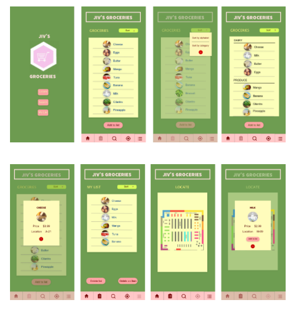
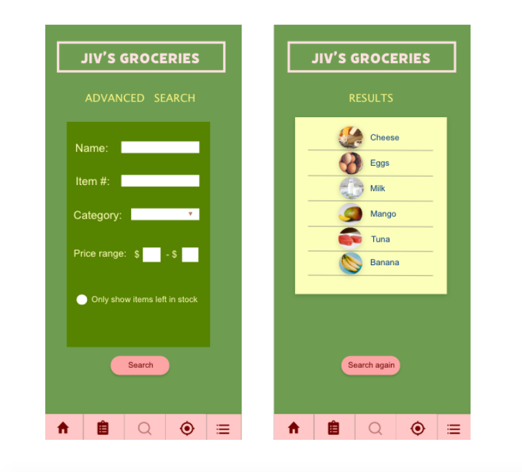
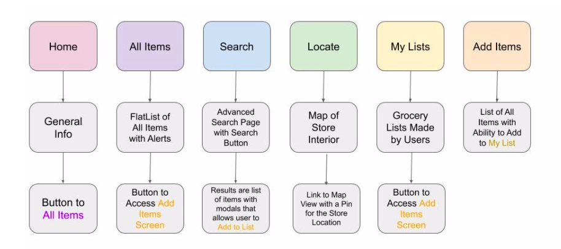
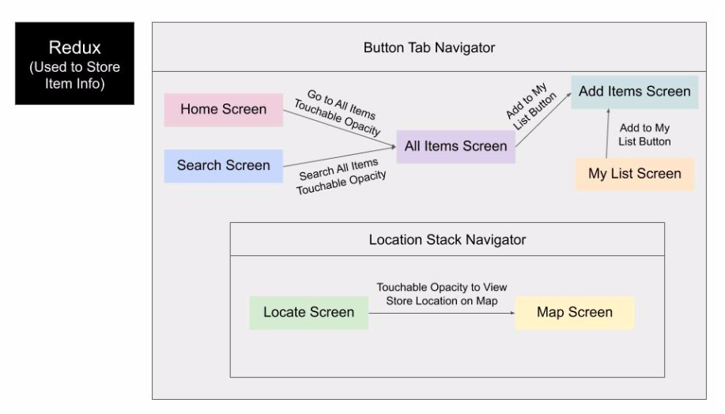

# Jiv's Groceries

### Design Review Report

### Team Members
Isha Sharma, Joshua Kruger, Vera Crabtree

### Mission Statement
Provide grocery store customers with a convenient way to maneuver around the store to find the items they are looking for efficiently and effectively.

### Audience
The audience for this app would be customer’s at this hypothetical grocery store. This app could be utilized both by younger audiences who are familiar and reliant on technology for day to day activities. This app may also be utilized by older shoppers who may use the app for assistance finding things in a store they struggle to find on their own. During this time of COVID-19, this app would also be beneficial in reducing a shopper's time physically in the store. Rather, they can create their list from home and determine where in the store they will need to go before even arriving at the store.

### Summary of User Feedback
#### Round One
One issue the clients had was that our website did not have a definitive home page. Originally we had planned to have the app open to the page that listed all items available at the grocery store, but they felt this was not intuitive and may confuse or intimate users. So, we opted to add an additional home screen to our page that gives general information about our grocery store and includes a button that can be used to access the “All Items” screen.
For the “All Items” page, our original wire frame consisted of a simple FlatList with each item name listed. The clients though this may be difficult for users to look through, and suggested we add images for each FlatList item so that it can be scrolled through and viewed more easily. We thought this was a great idea and plan to incorporate this feature. 
For the “My List” screen, we originally had it so that the user could only keep one list going at a time. The clients suggested allowing users to maintain more than one list, so it can be more useful for customers who want to have separate lists or multiple lists at a given time. We decided to change the screen name from “My List” to “My Lists” and will give users the option to store multiple lists on this page of the app.
#### Round Two
One suggestion we got for our client was to get a more definitive style for the app. As of right now it is fairly jumbled and we did not have a definitive style from screen to screen. So, we’ve been aiming to get a more definitive style throughout the app.
One task we wanted to work on for this round was to create our home screen. In order to do this the clients suggested we work on coming up with a name and logo. The clients also suggested having buttons on the home page that can lead the user to the other pages our app has available. So, we have added all of these suggestions to our sprint for next week and have started initially thinking of names and logos.
The clients wanted to actually get the search page working. Currently, there are some features shown on the screen, but it does not currently work with search functionality. We are planning to add this to our list of things to complete for the next sprint and hope to get this feature working.
#### Round Three
The clients wanted to actually get the search page working. Currently, there are some features shown on the screen, but it does not currently work with search functionality. We are aiming to finish the search page so that it can actually be used to search items in the All Items FlatList.
The clients suggested the next big feature we should work on implementing would be the “Locate” screen. This will require some research given we have not worked with maps in class yet. For our next sprint, we will begin looking into options to create this map feature and hope to have a basic implementation completed.
They also suggested we implement Redux in our app so that we can use that to store our data for the “Items” screen. For the next sprint, we are going to shift our data storage to Redux to store the grocery store items as per the client's request.
#### Round Four
The client wanted us to finish implementing Redux within our app. Although we were able to start getting Redux implemented, we ran into some issues during the previous sprint, so for this sprint completing this Redux functionality will be our top priority.
Once Redux is completely implemented, the clients wanted us to finalize the search page to work with this new Redux functionality. So, after getting Redux incorporated in our app, we will adjust the search screen and get it to work with the new Redux implementation.
The clients finally asked us to finish getting the store map implemented. Although we currently have a map view implemented to help shoppers locate where the store is, the clients still want to have the ability to locate where items are located in the store. So, we will be working to implement this by having an image and touchable areas within the image to mimic this sort of functionality.

### Improved Stack of Wireframes

#### Home/My list/Landing/Map

### UI Mockups
Mockup 1 (Isha)

### Site Navigation Chart (Vera)

### List of Requirements to Implement in the First Sprint
- Navigation
Description: Create navigation tabs and simple screens for all five of the apps pages (home, all items, search, locate, my lists)
Lead for that Feature: Vera
Test Requirements: User will be able to bounce back and forth between the tabs with ease, tab will change color when it is active, and simple text will change for each screen
- Basic Search - Isha
Description: Allow users to enter the name & search for the item they desire
Lead for that Feature: Isha
Test Requirements: User will be able to search an item available at the store
- FlatList
Description: Create and display a flat list for the user to see
Lead for that Feature: Josh
Test Requirements: User will be able to see a flat list

### List of Requirements to Implement in the Second Sprint
- Home Screen and Styling
Description: Create home screen that includes designed logo and app name as well as buttons to the other screens 
Lead for that Feature: Vera
Test Requirements: User will be able to view logo and use bottoms to other screens from home page 
- Completed Search & FlatList
Description: Allow users to enter the name & search for the item they desire
Lead for that Feature: Isha
Test Requirements: User will be able to search an item available at the store
- FlatList
Description: Create and display a flat list for the user to see
Lead for that Feature: Josh
Test Requirements: User will be able to see a flat list

### List of Requirements to Implement in the Third Sprint
- Basic Locate Screen
Description: Create basic locate screen using some sort of map library
Lead for that Feature: Vera
Test Requirements: User will be able to view the map of the grocery store, but will not yet be able to find where items are on the map
- Completed Search & Styling
Description: Allow users to enter information and search the All Items FlatList to see which items meet the given requirements 
Lead for that Feature: Isha
Test Requirements: User will be able to search the All Items FlatList and see if there is anything available at the store that meets the search requirements 
- Utilization of Redux
Description: Adding Redux functionality to store the information in our All Items FlatList and the My List FlatList, will include functionality to add and remove items from the My List FlatList
Lead for that Feature: Josh
Test Requirements: User will be able to view the data stored in Redux and implement the add and remove functionality for the My List FlatList

### List of Requirements to Implement in the Fourth Sprint
- Interior Store Map
Description: Add an image of the store directory with the ability to touch the image and locate items in the store
Lead for that Feature: Vera
Test Requirements: User will be able to view image of store interior and click on different areas of the image to determine which items are located there in the store
- Completed Search & Styling
Description: Allow users to enter information and search the All Items FlatList to see which items meet the given requirements 
Lead for that Feature: Isha
Test Requirements: User will be able to search the All Items FlatList and see if there is anything available at the store that meets the search requirements 
- Utilization of Redux
Description: Adding Redux functionality to store the information in our All Items FlatList and the My List FlatList, will include functionality to add and remove items from the My List FlatList
Lead for that Feature: Josh
Test Requirements: User will be able to view the data stored in Redux and implement the add and remove functionality for the My List FlatList

### Final Sprint Report
- What Was Implemented
Button Tab Navigator
Home Screen with Logo and TouchableOpacity linking to All Items Screen
All Items Screen with Alerts associated with each item available and the ability to add items to the My List FlatList
Search screen that includes slider and picker to allow customers to search for a specific item
Locate screen that includes image of interior of store and map view with a marker to indicate location of store
My List screen that displays all items added to the My List FlatList
Redux to store data
- What We Would Implement Next
Sort option for All Items Screen that will either sort items by category or alphabetical
Ability to click on the image of the interior map to help locate where items are located in the store
Ability to search using all the search options not just the name & item no.
Incorporation of a database to more effectively store data
Incorporate ability to have multiple lists
- App Architecture

### Repository
https://github.com/vcrabtree/GroceryStoreApp 

### Work Log
https://docs.google.com/spreadsheets/d/1NpRYdA5iHa-sIkuUI4Ju4ZTgD5Wo7kZSkY_RgIUb2W0/edit?usp=sharing 

### Libraries to Download
npm install @react-navigation/native
expo install react-native-gesture-handler react-native-reanimated react-native-screens react-native-safe-area-context @react-native-community/masked-view
npm install @react-navigation/stack
npm install @react-navigation/bottom-tabs
npm install redux@4.0.5 react-redux@7.2.1
npm install --save react-native-maps
npm install @react-native-picker/picker --save
npm install @react-native-community/slider  --save
npm install react-native-paper
 
